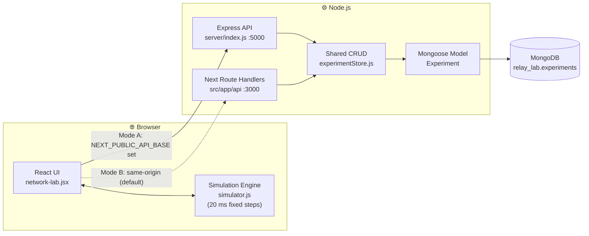
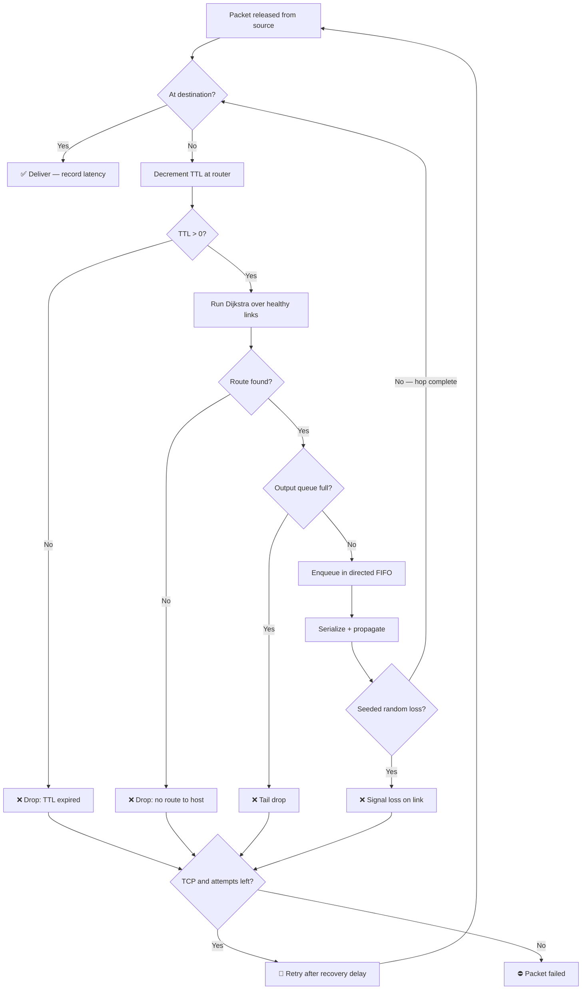

## 🏗️ Architecture

```mermaid
flowchart LR
  subgraph Browser["🌐 Browser"]
    UI["React UI<br/>network-lab.jsx"]
    ENG["Simulation Engine<br/>simulator.js<br/>(20 ms fixed steps)"]
    UI <--> ENG
  end

  subgraph Backend["⚙️ Node.js"]
    EXP["Express API<br/>server/index.js :5000"]
    NH["Next Route Handlers<br/>src/app/api :3000"]
    STORE["Shared CRUD<br/>experimentStore.js"]
    MODEL["Mongoose Model<br/>Experiment"]
    EXP --> STORE
    NH --> STORE
    STORE --> MODEL
  end

  DB[("MongoDB<br/>relay_lab.experiments")]

  UI -->|"Mode A: NEXT_PUBLIC_API_BASE set"| EXP
  UI -.->|"Mode B: same-origin (default)"| NH
  MODEL --> DB
```

> Both backends call the **same** `experimentStore.js`, so persistence logic exists exactly once.

### Packet lifecycle

```mermaid
flowchart TD
  A["Packet released from source"] --> B{"At destination?"}
  B -->|"Yes"| C["✅ Deliver — record latency"]
  B -->|"No"| D["Decrement TTL at router"]
  D --> E{"TTL > 0?"}
  E -->|"No"| F["❌ Drop: TTL expired"]
  E -->|"Yes"| G["Run Dijkstra over healthy links"]
  G --> H{"Route found?"}
  H -->|"No"| I["❌ Drop: no route to host"]
  H -->|"Yes"| J{"Output queue full?"}
  J -->|"Yes"| K["❌ Tail drop"]
  J -->|"No"| L["Enqueue in directed FIFO"]
  L --> M["Serialize + propagate"]
  M --> N{"Seeded random loss?"}
  N -->|"Yes"| O["❌ Signal loss on link"]
  N -->|"No — hop complete"| B
  F --> P{"TCP and attempts left?"}
  I --> P
  K --> P
  O --> P
  P -->|"Yes"| Q["🔁 Retry after recovery delay"]
  P -->|"No"| R["⛔ Packet failed"]
  Q --> A
```

---
